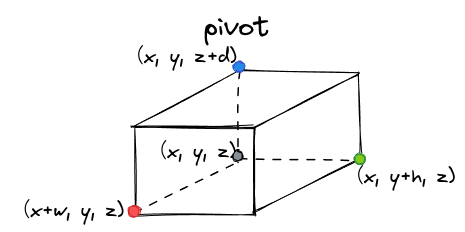
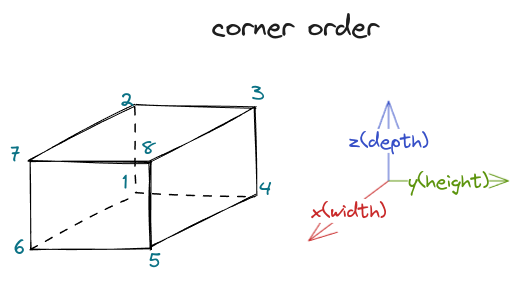

# Note

## Algorithm

* 伪代码

```plaintext
for loop(遍历所有给定的bin)
  for loop(遍历所有给定的item)
    判断是否生成角点(corner，被视为item)或者是否是第一个待放置的item，是则直接放入bin中的(0,0,0)位置，返回
    for loop(遍历当前item可以放置的三个方向，该方向表示以已放置的item的position为起点的offset的方向)
      for loop(遍历已放置的item，计算当前待放置的item的pivot)
        for loop(遍历待放置item的放置的“朝向”，最多可以有6个方向)：
          判断待放置item能否放置到bin中，能则将item放置到bin中，跳出循环，不能则继续循环，直到终止
          能放置时，可以修正pivot的位置，避免item“悬空”
```

* 判断 `item`能否放在当前 `bin`中：

  1. `item`放在当前 `pivot`时会否超出 `bin`
  2. `item`放在当前 `pivot`时会否与其他已经放置的 `item`干涉
  3. `item`检查当前 `bin`上的总重量
  4. `item`是否被下方物体支撑
* 修正已放置 `item`的位置（以修正 `H`为例）：处理放置 `item`悬空。

  1. 通过 `intersect`检测之后，说明当前 `item`和已放置的 `item`在 `WHD`方向上至少有一个方向没有交集（不与其他已放置 `item`碰撞）
  2. 取出已放置 `item`中和当前 `item`在 `WD(XZ平面)`的投影产生交集的 `item`，则该 `item`在 `H`方向上不会和当前 `item`有交集（因为两个 `item`已经在 `XZ`平面均有交集，则 `H(Y)`方向一定不会有交集）
  3. ~~将取出来的 `item`对应的坐标 `y_min`和 `y_max`按照 `y_max`的大小从小到大进行排列~~。取出来的 `item`对应的坐标 `y_min`和 `y_max`可以看成y轴上的线段。将所有 `item`的线段取出来，合并区间重合的线段（时间复杂度是$O(n\log(n))$，主要花费在排序上）。合并且排序后，如果前一个线段的 `y_max`与后一个线段的 `y_min`的差大于当前 `item`的高度，则说明可以将当前 `item`“夹”在这两个 `item`之间，并且不会产生交集（碰撞)，也即不会intersect
* `pivot`的计算方式：

  1. 遍历已放置的 `item`，当前 `item`放置的位置为以紧靠放置的 `item`为目的。遍历已放置 `item`，记位置为 `(x,y,z)`，则当前 `item`的放置方式有3种 `(x+w,y,z)|(x,y+h,z)|(x,y,z+d)`
  2. 由此得到的当前 `item`可能会“悬空”

  
* bin corner的生成顺序：

  

## TODO

* 改进：
  1. 第一个 `item`的初始放置位置为 `(0,0,0)`，可以指定初始放置的位置，比如可以是托盘的4个corner。
  2. 可以考虑 `pivot`的另外三种放置方式 `(x-w,y,z)|(x,y-h,z)|(x,y,z-d)`。更近一步，对已放置 `item`的5个外表面（不包括下表面)进行采样，生成更多的 `pivot`。这一步需要修改剪枝时 `item`是否超出 `bin`的判断方式。
  3. 当前算法是“一条路走到黑”，也即只要当前 `item`能被放置在某个位置，则之后所有的操作都不会修改已放置的 `item`的位置，引入“回溯”，每增加一个 `item`，相当于“树”上增加一个子节点。算法的时间复杂度会大大增加。
  4. 对生成结果进行更好地排序，考虑 `item`之间的高低关系，抓手能否进行放置等。
